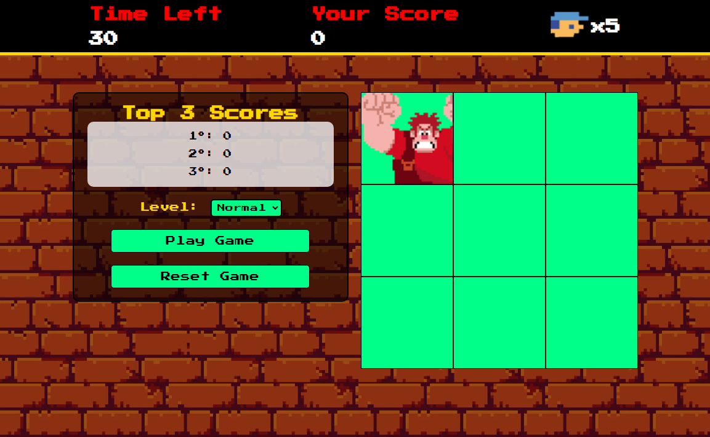

#  Detona Ralfh: 

Seja muito bem-vindo ao Detona Ralfh! Este jogo foi desenvolvido para treinar sua agilidade e precisão. O objetivo é acertar o inimigo quando ele aparece, acumulando pontos a cada acerto.



## Índice

- Objetivo
- Descrição do Projeto
- Como Jogar
- Tecnologias Utilizadas
- Estrutura do Projeto
- Funcionalidades
- Funcionalidades Futuras
- Contribuições
- Contato
- Observações

## 🎯 Objetivo

O objetivo deste projeto é criar um jogo divertido e desafiador que ajude a desenvolver a coordenação motora e a rapidez de reação dos jogadores. O jogo é ideal para todas as idades e oferece uma experiência de entretenimento enquanto testa suas habilidades. Além disso, este projeto faz parte de um desafio da DIO no bootcamp de Front-End em parceria com a Hihaapy, onde buscamos aplicar conhecimentos práticos em um ambiente de aprendizado colaborativo.

## 📖 Descrição do Projeto 

Detona Ralfh é um jogo interativo construído como um site estático utilizando HTML, CSS e JavaScript. O jogador deve clicar no inimigo que aparece na tela para marcar pontos. A cada acerto, o jogador ganha pontos, e a cada erro, perde vida. O jogo inclui um cronômetro e um ranking para mostrar as melhores pontuações.

Durante o desenvolvimento, a estrutura do jogo foi pensada para ser intuitiva e divertida, oferecendo uma mecânica de jogo simples, mas envolvente. O projeto é uma demonstração do progresso no aprendizado de desenvolvimento web, permitindo que jogadores se divirtam enquanto aprimoram suas habilidades motoras.

## 🎮 Como Jogar

Para jogar Detona Ralfh, siga estas etapas:

- **Escolha o Nível:** Selecione o nível de dificuldade desejado.
- **Clique em Play:** Inicie o jogo clicando no botão de "Play".
- **Acertar o Inimigo:** Fique atento ao inimigo que aparece e clique nele para marcar pontos. Cada acerto gera pontos e cada erro resulta em perda de vida.

## 🛠️ Tecnologias Utilizadas 


- **HTML5**: Para a estruturação do conteúdo.
- **CSS3**: Para estilização da página.
- **JavaScript**: Para a lógica do jogo e interatividade.

## 🗂️ Estrutura do Projeto 

A organização dos arquivos no projeto é a seguinte:
```bash
| index.html
| README.md
| assets/
| ├── audios/
| │   └── [sons do jogo]
| ├── css/
| │   └── reset.css
| │   └── style.css
| ├── images/
| │   ├── [imagens e ícones]
| └── scripts/
|     └── engine.js
```

## ⚙️ Funcionalidades

- **Escolha de Nível:** O jogador pode escolher entre diferentes níveis de dificuldade.
- **Botão de Play e Reset Game:** Permite iniciar e reiniciar o jogo facilmente.
- **Pontos e Vidas:** O jogador ganha pontos a cada acerto e perde vidas a cada erro.
- **Ranking:** O jogo exibe as melhores pontuações.

## 🌟 Funcionalidades Futuras

- **Melhoria na Responsividade:** Tornar o jogo responsivo para melhor adaptação em diferentes dispositivos.
- **Adição de Animações:** Implementar animações e transições para uma experiência mais dinâmica.
- **Otimização para Acessibilidade:** Melhorar a acessibilidade para usuários com necessidades especiais.

## 🤝 Contribuições

Contribuições são bem-vindas! Para contribuir:

- **Abra uma Issue:** Relate um bug ou sugira uma melhoria.
- **Crie um Pull Request:** Faça alterações no código e envie uma solicitação para revisão.

## 📧 Contato

Para perguntas ou feedback, entre em contato:

- **E-mail:** [nina.kastro@icloud.com](mailto:nina.kastro@icloud.com)
- **LinkedIn:** [LinkedIn](https://www.linkedin.com/in/karinacmartins/)
- **GitHub:** [GitHub](https://github.com/karinacmartins)

## Observações

O jogo está em desenvolvimento contínuo e novas funcionalidades serão adicionadas ao longo do tempo.

<br>
<br>

<div align="right">Made with 💜 by <a href="https://github.com/karinacmartins">KM</a>.</div>
